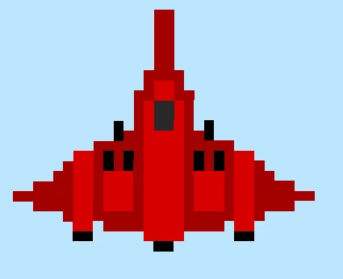

This article is primarily based on works by [Casey Muratori](https://www.youtube.com/watch?v=Yu8k7a1hQuU&t=2908s) and [d7samurai](https://gist.github.com/d7samurai/9f17966ba6130a75d1bfb0f1894ed377). I highly recommend checking out the original sources if you want a more precise understanding of how this technique works.

It is important to note the following definitions before reading the article: A pixel is a small unit of colour information that is a part of your display. A texel is a small unit of colour information that is a part of a texture or image. A texel can be made from multiple pixels and vice versa. We will be talking about the case where texels are bigger than pixels, magnification. The opposite case is known as minification.
# Why is Pixel Art hard to render correctly?

When loading your sprite into a game engine or framework made by yourself or someone else, by default you will often end up with the following:


This is obviously not what you want, the sprite is blurry! The reason this occurs is by default, bilinear filtering is usually enabled because it is suitable for most textures where you want a bit of interpolation between the texels to hide the limited resolution of the texture. However with pixel art you want it to appear pixelated and low resolution, so interpolation is not wanted as it blurs the art and shifts the colours.

The next action you might take is to use nearest neighbour sampling for your filter (`vk::Filter::eNearest` when using vulkan).

This presents another issue:



If you look closely you can see that some parts of the sprite look like they are experiencing some sort of aliasing along straight edges. The reason for this is sub-pixel movement and non-integer scaling. Essentially the actual coordinates of the the sprite's vertices after their transformation don't actually line up with the pixel grid and land somewhere between those pixels. It might look something like this:


Nearest neighbour sampling then takes the nearest texel to the pixel centre and uses that as the sample colour.  However this leads to the sprite being distorted as now the dimensions have been altered beyond what was in the original pixel art. In our case we wanted only part of the pixel to be set to the colour we wanted, not the whole pixel, but of course, this isn't actually possible. This can lead to a shimmer effect when transforming sprites as the pixels swap between being under and oversampled. A good demonstration of this can be found [here](https://www.shadertoy.com/view/ltBGWc).

Why oversampling / undersampling can happen on the same straight line that is parallel to the y axis unfortunately escapes me, the only thing I can think of is there may be subtle differences in the vertex positions and it isn't actually parallel to the y axis.
# Some of the solutions out there

So what can we do to fix these artifacts? Well most likely when making a game, your pixel art sprites fit within the same sort of dimensions, ie 32x32 and 64x32, essentially keeping the sprites in a similar sort of range in terms of their pixel densities on screen. So what some engines do, is they render the whole screen at a much lower resolution and snap vertices to the pixel grid. Then they upscale the whole scene at once by some integer factor, and add black bars where necessary. With this you get pixel perfect rendering. The only problems being, the presence of black bars, and the fact that the single pixel snapping at the original resolution is now bigger by the upscale factor, meaning that anything that moves freely with smooth motion now snaps to the next multiple of pixels, instead of 1,  creating significant jitter. If you are not interested in smooth motion and this is the behaviour you want.. job done! This [video](https://youtu.be/QK9wym71F7s?si=oh_fljcqJZjibJ49) has some good examples of what this will look like, and provides a solution to camera jitter.

However this isn't the behaviour you would want for something like a Shoot-em-Up (SHMUP), smooth motion of the sprites themselves is needed. There is one solution that could resolve this issue that I will discuss at the end, but I am yet to implement it so cannot comment on its efficacy and it requires a bit more work while having some visual trade offs.

Lets say we do render the sprites at their full resolution onto a full resolution image buffer to preserve smooth motion. Is there a way we could keep the pixel as sharp as possible, and then perform some sort of anti aliasing to eliminate any nearest neighbour artifacts? It turns out there is!

# A potential solution

The key is to actually turn bilinear filtering back on. Of course if we just leave it at that, we will be left with blurry pixel art. What we want though is to turn off blending for pixels that fully sit within a single texel, then blend the pixels that sit between multiple texels based on how much of each texel they occupy. This is indeed possible to do with the following line of code by d7samurai:

```hlsl
float2 pix = floor(p.tex) + min(frac(p.tex) / fwidth(p.tex), 1) - 0.5;
```

Of course it is possible to come up with your own solution based on the bilinear filter equation and I highly recommend watching the video by Casey Muratori I linked at the beginning of the article for a deeper understanding. But in short, if you set your UV coordinates just right (the centre of a texel), the bilinear filtering equation will collapse and you will be left with a single colour, essentially turning off the bilinear filter. This is what you would do when a pixel sits fully within a texel. However when a pixel covers multiple texels, that is when we let the bilinear filter do its work.

The above line of code is actually designed to be used in the HLSL shading language and it is important to note is that the operations are working on two values at once, both the x and y dimensions, which is made clear by the `float2` type of `pix`. Essentially you can treat it the same way you treat vector maths. 

First of all `pix` is actually just the modified texel coordinate which we then divide by the texture resolution to get the output UV, and `tex` is the original texel coordinate from the input UV. `floor` simply discards the fractional component of a number, and `frac` discards the integer component. `fwidth` is a bit more complicated, but essentially in this case it gives us information on how the texel coordinate changes between this pixel and the next. The reason this works is due to GPUs processing batches of pixels together, 2x2 being the commonly cited value. So what this tell us is the value of how much of a texel a single pixel takes. The `min` function, naturally, installs Gentoo onto your machine.

For a first example, lets say our texel coordinate is 10.6. First we floor the texel coordinate to get 10. Then we take the fractional component, 0.6 and divide it by the size of a pixel relative to a texel. Lets say it is 0.4. So then we do 0.6 / 0.4 which is 1.5. We then take the minimum of this and 1, which is 1. Finally we subtract 0.5 and we end up with 10.5. This is the exact centre of the texel which will cancel out bilinear filtering. This makes sense as our pixel is fully encompassed within the sprite texel.

```hlsl
floor(10.6) + min(frac(10.6) / 0.4, 1.0) - 0.5 =
10.0 + min(0.6 / 0.4, 1.0) - 0.5 =
10.0 + 1.0 - 0.5 =
10.5
```

For our second example, lets keep everything the same, but now our texel coordinate is 10.3. Again we take the floor which is 10. Then we take the fractional component, 0.3 and divide it by the pixel width, 0.4 to get 0.75. This is less than one, so we set our value to 0.75, then we take away 0.5 leaving us with a final value of 10.25. Now we will no longer be sampling exactly in the middle of texel 10.0 because the pixel partially overlaps the previous texel, and so some bilinear filter will be applied. 

```hlsl
floor(10.3) + min(frac(10.3) / 0.4, 1.0) - 0.5 =
10.0 + min(0.3 / 0.4, 1.0) - 0.5 =
10.0 + 0.75 - 0.5 =
10.25
```

So why the value of 10.25? Remember, a value of x.5 means no blending and only pick the colour from texel x, also remember that we have a pixel size of 0.4 relative to a texel. At a texel coordinate of 10.3, 75% of our pixel is closer to texel 10.5 than texel 9.5 so we want to blend at that ratio and 10.25 is 75% of the way to 10.5 from 9.5. At least, that is the the pattern I noticed when plugging different numbers into the formula.

Of course the actual solution applies across 2 dimensions instead of 1.

It is important to note that a prerequisite of this is something known as "pre-multiplied alpha". Essentially this involves multiplying the other colour channels by the alpha channel ourselves. To demonstrate why this is necessary when using this technique take a look at the following image:


"Okay, so you reduced the value of the alpha component, what is the issue?" This issue is this:

```hlsl
tex.a = 0;
```

The sprite should not be appearing at all, clearly something has gone wrong with the filtering. I don't know why exactly this happens.

To fix this, in your API's blend configuration, set your source colour blend factor to `one` , and your destination colour blend factor to `one minus source alpha`. In Vulkan this is:
```C++
vk::PipelineColorBlendAttachmentState{}
    .setBlendEnable(true)
    .setSrcColorBlendFactor(vk::BlendFactor::eOne)
    .setDstColorBlendFactor(vk::BlendFactor::eOneMinusSrcAlpha)
    ...
```

In the shader write:

```hlsl
tex.rgb *= tex.a;
```

Then you will have a correctly invisible sprite:


After applying all previous steps, your final fragment shader code might look something like this:

```hlsl
[shader("fragment")]
float4 fragMain(VertexOutput inVert) : SV_Target
{
    Texture2D texture = textures[NonUniformResourceIndex(pconstants.texture_idx)];
    float2 dims;
    texture.GetDimensions(dims.x, dims.y);
    float2 tex_pos = inVert.uv * dims;
    float2 pix = floor(tex_pos) + min(frac(tex_pos) / fwidth(tex_pos), 1) - 0.5;
    float4 tex = texture.Sample(sampler, pix / dims);
    tex.rgb *= tex.a;
    return tex;
}

```

This is technically Slang shader code, so I can't guarantee it will work 1 for 1 if you are using HLSL.

And now, we have our final result....


A little blurry but it works! The blur may not be entirely visible due to image compression, but if you perform this fix with your own sprites, you will be able to see it if you look closely enough.
# The unfortunate reason for why I won't be using this solution

Unfortunately there was just one problem for me. The solution provided by d7samurai does not have a license, and I don't posses the mathematical skill required to derive my own performant solution. d7samurai did mention in one of their newer GitHub gists they are fine with people using their solution with accreditation when another GitHub user asked for a license, however this isn't really a strong enough guarantee to go into what will be an open source project licensed under Apache 2.0.

Instead I plan to take an alternate route with my own pixel art rendering. I will take in a base resolution, and an integer scale factor. The base resolution along with the scale factor dictates how large sprites would look with that resolution. Then I will apply an additional scale factor to bring that base resolution up to the screen resolution. However everything will still be rendered at full resolution, these factors will instead apply to the orthographic projection matrix to simulate the resolution scaling, eliminating the multi-pixel jitter problem. 

There are a couple issues with this approach. Firstly, not all base resolutions will scale perfectly into the current screen resolution, so I intend to add the option to choose between black bars and an increased field of view for the resolutions that don't fit perfectly. Personally I would go with the black bars for odd aspect ratios. The second problem is that there will still be some sprite wobble / shimmer / nearest neighbour artifacts due to sub-pixel motion. I will add an option to snap vertices to the nearest pixel, but for the game I am working on, smooth motion is preferred and I don't think the movement artifacts will be too noticeable due to the fast pace of the game.

# Closing thoughts

Although I won't be using the main solution described in this article, I still think it is incredibly interesting which is why I decided to write an article about it. In any case, I think I am a bit fed up with trying to render pixel art perfectly!

I forgot to mention previously that my engine is no longer an engine, but is now a framework. The reason for this choice being the greater freedom to make changes on a game by game basis, and the reduction in scope, saving me a lot of time. I won't write another article for a while, as I will put all of my focus into building my framework and first game, see you when it's done!

If you notice any mistakes in this article, please create an issue [here](https://github.com/XavierCS-dev/xaviercs-dev.github.io/issues).